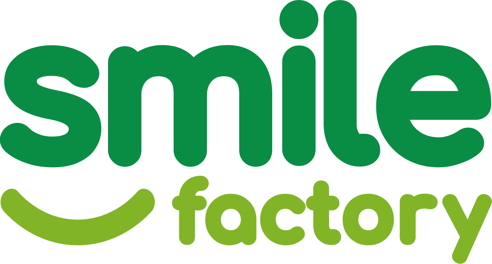

# Coming Soon Page

A beautiful, responsive "Coming Soon" landing page for Smile Factory - Innovation Ecosystem Network.

## Features

✨ **Modern Design**
- Gradient background with animated particles
- Smooth animations and transitions
- Fully responsive (mobile, tablet, desktop)

⏱️ **Countdown Timer**
- Live countdown to launch date
- Displays days, hours, minutes, and seconds
- Automatically updates every second

📧 **Email Notification Form**
- Collect email addresses from interested visitors
- Clean, modern input design
- Form validation included

🎨 **Visual Elements**
- Smile Factory logo
- Clear messaging about the platform
- Professional gradient color scheme (purple theme)

🔗 **Social Media Links**
- Facebook
- Twitter
- LinkedIn
- Instagram
- Hover animations on all icons

## Customization

### Change Launch Date

Edit line 299 in `index.html`:

```javascript
const launchDate = new Date('2025-12-31T00:00:00').getTime();
```

Change the date to your desired launch date.

### Update Logo

The logo path is currently set to:
```html

```

Options:
1. Keep this path if deploying from the root directory
2. Copy the logo to the `coming-soon` folder and update to:
   ```html
   
   ```
3. Use an absolute URL for the logo

### Update Social Media Links

Edit lines 313-316 in `index.html`:

```html
<a href="https://facebook.com" target="_blank" class="social-link">
<a href="https://twitter.com" target="_blank" class="social-link">
<a href="https://linkedin.com" target="_blank" class="social-link">
<a href="https://instagram.com" target="_blank" class="social-link">
```

Replace with your actual social media URLs.

### Customize Colors

The main gradient colors are defined in the CSS:
- Primary gradient: `#667eea` to `#764ba2` (purple theme)

To change colors, search and replace these hex values throughout the file.

### Update Message

Edit the message text (around line 286):

```html
<p class="message">
    We're building something amazing! Our platform will connect innovators, investors, mentors, and students 
    to create meaningful collaborations and drive innovation forward.
</p>
```

### Email Form Integration

Currently, the form shows an alert. To integrate with a backend:

1. Replace the form handler (lines 334-341) with your API call:

```javascript
document.getElementById('notifyForm').addEventListener('submit', async function(e) {
    e.preventDefault();
    const email = document.getElementById('emailInput').value;
    
    // Send to your backend
    try {
        const response = await fetch('/api/subscribe', {
            method: 'POST',
            headers: { 'Content-Type': 'application/json' },
            body: JSON.stringify({ email })
        });
        
        if (response.ok) {
            alert('Thank you! We will notify you at: ' + email);
            document.getElementById('emailInput').value = '';
        }
    } catch (error) {
        alert('Something went wrong. Please try again.');
    }
});
```

## Deployment

### Option 1: Standalone Deployment
Simply upload the `coming-soon` folder to your web server.

### Option 2: Root Deployment
Move `index.html` to your root directory and update the logo path.

### Option 3: Apache Deployment
If using Apache, you can redirect all traffic to this page by creating a `.htaccess` file:

```apache
RewriteEngine On
RewriteCond %{REQUEST_URI} !^/coming-soon/
RewriteRule ^(.*)$ /coming-soon/index.html [L]
```

## Browser Support

- ✅ Chrome (latest)
- ✅ Firefox (latest)
- ✅ Safari (latest)
- ✅ Edge (latest)
- ✅ Mobile browsers

## File Structure

```
coming-soon/
├── index.html          # Main coming soon page
└── README.md          # This file
```

## Preview

To preview locally:
1. Open `index.html` in your browser
2. Or use a local server:
   ```bash
   # Using Python
   python -m http.server 8000
   
   # Using Node.js
   npx serve
   ```

## License

© 2025 Smile Factory. All rights reserved.

